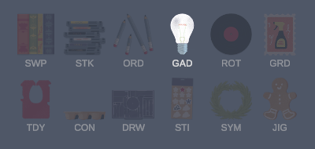
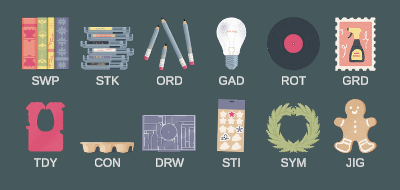

# A Little To The Left - Archipelago

An [Archipelago](https://archipelago.gg) multiworld randomizer for
[A Little To The Left](https://store.steampowered.com/app/1629520/), the
tidying puzzle game.

**Status: playable.** A seed generates, the game connects to it, and the run
plays through to the credits.

## What gets randomized

The run is shaped like the base campaign - a scrolling filmstrip of cards -
but most of the puzzles in it are **procedurally generated**. Sixteen of the
game's puzzles build a fresh layout from a seed, so they are new even if you
have finished the game. They are mixed with the seasonal Archive puzzles and
with hand-made campaign puzzles where those are the only source of a mechanic.

**Locations.** Three kinds. Every distinct **solution** is a check, and puzzles
with several valid arrangements give several. Every **group** of objects you
tidy is a check, on puzzles made of more than one group - on a single-group
puzzle the group and its first solution are the same event, so only one check
is minted. And the **credits**.

Finishing a puzzle is not a check of its own. It is an event the generator
counts toward the goal, which is why a single-group puzzle pays one check
rather than two.

**Items.**

- **Puzzle Packs.** A run has no chapters. A pack opens the next block of
  cards instead - five puzzles at a time by default. Every block is the same
  size, the free opening included, and only the last is short.
- **The twelve mechanics**, one item each: Swapping, Stacking, Ordering,
  Gadgets, Rotating, Grids, Tidying, Containers, Drawer, Sticking, Symmetry
  and Jigsaw. Seeing Stars adds a thirteenth, Distributing, when it is on.
- **Credits.** A real item in the pool, so it can be anywhere in the
  multiworld, including in somebody else's world.
- **Skips.** Clears a puzzle you are stuck on. It finishes the puzzle and
  counts toward the goal, and it fills in every check on it - so a skipped
  puzzle is starred as well as beaten.
- **Hint Pages.** Without one the notepad still opens; you just cannot erase
  the scribble.
- **Cat Trap.** The cat walks through an active puzzle and knocks your
  arrangement over. It costs time, never progress.
- **Background Change Trap.** Repaints the background.

**The goal.** Two conditions, and both are required: beat (or star) a set
number of puzzles, AND find the Credits item. Either one alone does nothing.
Together they unlock the credits card, which sits at the end of the track and
is not part of any pack - and you then have to go and play it. Reaching the
count does not end the run by itself, deliberately: the run ends when you
watch the ending.

Packs and abilities are the two gates, and they gate different things. A pack
decides which cards you may open at all. An ability decides what you may touch
once you are inside one: objects belonging to a mechanic you have not found
sit dimmed and cannot be moved, so a puzzle can be partly solved, left, and
come back to when the missing ability arrives.

### Ability locks

Twelve of the base game's own mechanics are items. The level select carries
all twelve as a strip, so what is still out there is visible rather than
something to keep a list of.

Dim is a mechanic you have not found yet:



Lit is one you hold:



The icons are the game's own art rather than anything drawn for the mod - a
badge element, a puzzle piece or a level's object, one per mechanic, chosen to
be told apart at that size. Provenance for all twelve:
[docs/data/ability-icons.md](docs/data/ability-icons.md).

Seeing Stars adds a thirteenth. Distributing is the one DLC mechanic the base
game has no equivalent of - it governs a single puzzle, the pizza - so it
appears only in a run that drew that level, and the strip wraps to a third row
to hold it:


### What the mod puts on screen

- **A badge on every card**, saying whether the card is worth opening: green
  when everything left on it can be done now, green over red when only some of
  it can, solid red when none of it can yet, and a star when there is nothing
  left. A red card is also veiled - the game's own locked look means only "not
  reached yet", which is a different thing.
- **The ability strip** above, and **a progress counter** reading in the same
  terms as the goal - starred or beaten, whichever this seed asked for.
- **An Archipelago pane on the main menu** for the server (host and port
  together), slot name and password, so connecting never means editing a
  config file.
- **Toasts** for what you find and receive, coloured the way Archipelago's own
  text client colours them.
- **Play and the next arrow** open the next puzzle the RUN wants, rather than
  the next one in the campaign's order.

### Options

All set in the yaml. The ones that change a run most:

- `goal` - `beat_levels` or `star_levels`, each with its own count
  (`levels_to_beat`, `levels_to_star`).
- `puzzle_count` - 8 to 79.
- `pack_size` - how many puzzles a pack opens. Read it as a floor rather than
  a promise: a run always opens at least five, and packs grow together when
  yours would need more than the fourteen a run can carry.
- `generator_weight`, `archive_weight`, `base_weight` - relative weights for
  the three sources: procedurally generated, seasonal event, main campaign.
  Ratios rather than percentages, so 80/10/10 and 8/1/1 mean the same thing.
- `mechanic_coverage` - slots reserved so scarce mechanics are guaranteed to
  turn up. Higher is LESS random, not more: every point pins more of the run
  to a fixed set of levels.
- `ability_locks`, `starting_abilities`, `guaranteed_open_slots` - whether
  mechanics are gated at all, and how much of that gate you start past.
- `skip_count`, `hint_coverage`, `cat_trap_chance` - how many Skips exist,
  what share of this seed's hint pages become items, and what share of the
  filler is the cat.
- `archive_packs` - which seasonal packs are in. Without DLC, jigsaws exist
  only in four of them, so dropping those four removes the mechanic and its
  item with it.
- `generator_repeat_limit` - how often one generated puzzle may repeat.
- `cupboards_and_drawers`, `seeing_stars` - the two DLCs, both off by default,
  each with its own weight beside the three above.

**Both DLCs are supported, and both are off by default.** Cupboards and Drawers
adds 25 puzzles and 32 solutions; Seeing Stars adds 37 puzzles and 100
solutions - more alternate solutions than the whole base campaign, which makes
it the one that changes a star goal most. Five of its puzzles are locked by the
game behind a star total, and the mod opens those.

Only the player needs the DLC: the generator does not, and the mod refuses a
seed asking for one that is not installed rather than handing over a puzzle
that cannot open.

Full detail, including every option and what each item does:
[the world's game page](apworld/alttl/docs/en_A_Little_to_the_Left.md).

## Install

1. **BepInEx 6 (IL2CPP)**: unzip
   [BepInEx-Unity.IL2CPP-win-x64-6.0.0-pre.2.zip](https://github.com/BepInEx/BepInEx/releases/tag/v6.0.0-pre.2)
   into the game folder - the one containing `A Little To The Left.exe`.
2. **First launch**: start the game, wait for the main menu, quit. This launch
   is slow because BepInEx is generating interop assemblies.
3. **Mod**: unzip `ALTTLArchipelago-X.Y.Z.zip` from the
   [releases page](../../releases) into the same game folder.
4. **Archipelago host**, only if you are generating the multiworld: install
   [Archipelago](https://github.com/ArchipelagoMW/Archipelago/releases/latest)
   0.6.7 or newer, put `alttl.apworld` (same release) into its
   `custom_worlds/` folder, and `A Little to the Left.yaml` into `Players/`.

The three release files ship together and carry the same version number. A mod
and an apworld that disagree about the version disagree about the item table,
so the mod refuses such a pair when it connects rather than playing a subtly
wrong run.

Details, the yaml options and troubleshooting:
[docs/installation.md](docs/installation.md).

## Connect

Launch the game and use the **Archipelago** button on the main menu. Three
fields: **Server** (`host:port`, as the room page gives it), **Slot name**, and
**Password**. The run appears on the level select once you are connected.

A run also survives the server going away. If nothing answers at launch, the
mod resumes the last run from a cache of the slot data and the received items,
queues anything you earn, and sends it on the next connection.

## Repository layout

- `src/ALTTLArchipelago/` - the BepInEx mod that plays a seed. Deliberately
  thin: it holds the Unity and Archipelago-client glue and nothing decidable
  without them
- `src/ALTTLArchipelago.Core/` - the mod's rules and state as pure C# with no
  Unity dependency, so all of it is unit-testable. It must never reference
  Unity, BepInEx or the game's interop assemblies, and CI builds it standalone
  on a runner with no game installed to keep it that way. Ordinary .NET packages
  are allowed by exception, each with a reason in the csproj - currently one,
  the Archipelago client, for the enums the protocol defines
- `src/ALTTLArchipelago.Core.Tests/` - those tests
- `src/ALTTLModKit/` - pieces that know nothing about Archipelago or this game:
  a toast overlay, a Rewired typing guard, a socket-thread-to-main-thread
  dispatch queue, and a Windows virtual-desktop helper. A separate project so a
  reference back into the mod cannot compile, which is what keeps them
  extractable
- `src/ALTTLDevTools/` - the research and survey plugin. Deliberately not part
  of the randomizer, installed separately, never shipped. Its commands are in
  [docs/devtools.md](docs/devtools.md)
- `apworld/alttl/` - the Archipelago world (Python)
- `docs/installation.md` - what a player does with the three release files
- `docs/research-findings.md` - the modding surface: what was proven, and how.
  This is where "is the game moddable" is answered, at length
- `docs/content-report.md` - the content: base game, daily, archive, DLC, with
  level and solution counts
- `docs/verification-log.md` - an archive of the Phase 0 gate and the bug
  journal that followed it, to 2026-09-06. The CHANGELOG has carried this
  record since; several source comments cite this one by name
- `docs/in-game-testing.md` - how to test against the one real install without
  leaving a mess in it, and the harnesses that once measured nothing
- `docs/release-testing.md` - checking a release actually works, automatically
  or by hand, and the log lines that tell you it did
- `docs/cat-trap-tests.md` - what the cat trap does and the battery that proves
  it. The trap has been wrong three times and passed a test each time
- `docs/manual-hint-test.md` - the Hint Page gate, which needs hands on a mouse
- `docs/backlog.md` - what has been raised and not yet done. Currently empty,
  and says so
- `docs/data/` - probe output and investigation write-ups: the prefab-derived
  level table, the generator sweep, and the notes from questions that were
  settled by measuring. Reference and history, read by nothing
- `fixtures/` - the two files that ARE read, by tests in both languages. See
  `fixtures/README.md`
- `docs/superpowers/specs/` - the original design doc, kept as history. It
  describes a product that no longer exists and says so at the top
- `tools/ap-sync.ps1` - copy `apworld/alttl` into the Archipelago clone
- `tools/offline_test.py` - five phases proving a run survives the server going
  away and rejoins when it comes back, including that a regenerated seed under
  the same slot name does not come up on the cached plan
- `tools/offline-reconnect-test.py` - the one claim that needs the pane:
  pressing Connect during an offline run against a server that is still down
  must leave the run alone
- `tools/harness_env.py` - snapshot the player's BepInEx config and save folder
  before a harness runs and restore them after, including on Ctrl-C. Wrap any
  new harness that writes either. `--restore-latest` recovers from a hard kill
- `tools/release_e2e.py` - the release gate: clean the install to vanilla,
  install the release assets, generate a seed, and play it through. Fifteen
  minutes. It is a CONFIRMATION, never a debugger - the four tools below
  answer the same questions in milliseconds, one layer at a time, and the
  gate is what you run once they all pass
- `tools/make-seed.py` - generate the gate's base or DLC seed with
  `Generate.py` alone, no game and no server, into `testserver/out-base` or
  `testserver/out-dlc`. Everything below reads one of those
- `tools/test_harness_data.py` - the DATA layer: reading a seed, mapping
  locations to slots, planning a completion order. Set `ALTTL_SEED_DIR` to
  say WHICH seed; it defaults to the gate's own output
- `tools/test_scheduler.py` - the CHOICE layer: which slot to play next,
  over synthetic worlds. Kept honest by `tools/mutate-scheduler.py`, which
  puts each real bug back and fails if the suite does not notice
- `tools/test_run_model.py` - DATA and CHOICE composed, against a real
  seed's actual pack, ability and Skip economy. Answers "can this seed be
  cleared at all" before anyone spends fifteen minutes finding out
- `tools/predict_gate.py` - **run this before the gate, every time.** The
  run is deterministic: the seed is fixed, the abilities and Skips come
  out of it, the scheduler is a pure function, and `--steady` removes the
  cat traps. So the gate's verdict can be computed, and this computes 13
  of the 25 assertions from the simulated run - the beaten count, the
  Skip ledger, packs, checks, credits, the goal. Every gate failure on
  2026-09-21 was one of those thirteen and none of them needed the game.
  A dirty prediction means fix that first; a clean prediction that the
  gate contradicts is a bug in the model, which every fast test depends
  on
- `tools/probe-slots.py` - the DRIVE layer: can the harness boot and solve
  each level, ONE AT A TIME, a fresh session each. `--dlc` reads the DLC
  seed. `unforceable` is a correct outcome; `gated` is NOT a pass - it
  means the level was never attempted, so pair it with a locks-off seed
  (`make-seed.py --dlc --quick --tag dlc-open`) to measure solving
- `tools/probe-session.py` - the same levels in ONE session, which is how
  the gate plays them. Changes exactly one variable against probe-slots,
  because a level can solve perfectly in isolation and fail after the
  process has already played three others
- `tools/probe-isolation.py` - the five gate assertions that had no tool of
  their own: the error census, the controller-table audit, and the three
  that matter most if they ever break - the campaign save untouched, no
  real daily credited, no DLC puzzle written to the campaign. All are
  measurements over a SESSION rather than a run, so one launch answers
  what a fifteen-minute gate was being used for
- `tools/window-size.py` - open the game small for harness runs. Asks the
  RUNNING game for its own resolution list and picks the nearest index to
  1280x720, because the saved value is an index into a list the game
  rebuilds per monitor - the same number means different sizes on
  different displays. Verify by the live size, never the saved index: this
  machine had the save reading 1920x1080 while the game ran at 3840x2160
- `tools/mutate-apworld.py` - the same mutation discipline for the world's
  DLC tests: nine bugs put back, all must be caught
- `tools/build_apworld.py` - package the world into a distributable
  `alttl.apworld`
- `tools/package-release.py` - build all three release assets and refuse if the
  version numbers disagree or the build produced a file it does not recognise
- `tools/check-version.py` - the version lives in three files; fail when they
  drift. `--set X.Y.Z` writes all three
- `tools/check-devtools.py` - every DevTools command is dispatched by the
  ladder AND documented, in both directions. DevTools references the game,
  so CI cannot build it and it will never have a test project; this is the
  only automated thing standing between it and a command that silently
  cannot run, which has already happened once
- `tools/check-game-facts.py` - compare the level table with a dump from the
  running game. A required release step that nothing invokes for you; see
  `docs/release-testing.md`
- `tools/deploy.sh` - build and copy the plugin into the game, closing it first
- `tools/playthrough.py` - drive a scripted run for a harness to watch
- `.github/workflows/ci.yml` - Core built with no game installed, Core tests,
  the world's tests against the minimum supported Archipelago version, the
  packaged apworld generating a real seed, and an ASCII-only check

## Building the mod

```
cp src/GameDir.props.example src/GameDir.props   # point it at your install
dotnet build src/ALTTLArchipelago                # deploys into the game
```

The game must be closed, and BepInEx must have been launched once so the
interop assemblies exist.

**This is the one thing CI cannot build.** It references BepInEx interop
assemblies generated from a local install, so a runner with no game cannot
compile it. That is the whole reason `ALTTLArchipelago.Core` exists without any
game references: everything decidable without Unity lives there and IS tested in
CI, including the slot_data contract against a payload the generator really
produced. If you want CI to build the plugin too, the usual answer in the
BepInEx world is a separate repo publishing stripped reference assemblies as a
NuGet package, the way TromboneChamp and Outer Wilds do it.

To try it against a real seed, generate one, serve it with
`python Archipelago/MultiServer.py --port 38281 <seed>.zip`, then set Host,
Port and SlotName in `BepInEx/config/droha.alttl.archipelago.cfg` and launch.

## The Archipelago world

`apworld/alttl/` is the generator side. It needs an Archipelago checkout to run
against; the repo expects a clone at `Archipelago/`, which is gitignored.

```
powershell tools/ap-sync.ps1                              # copy the world in
cd Archipelago
python -m unittest discover -s worlds/alttl/test -t .
```

The fill is seed-dependent, so a single seed proves very little - that is how a
broadly broken fill once sat behind a fully green suite. `test_fill_stress.py`
sweeps option configurations across a span of fixed seeds; widen it before a
release:

```
ALTTL_STRESS_SEEDS=200 python -m unittest worlds.alttl.test.test_fill_stress
```

To roll a real seed, put a yaml in a folder and run
`python Generate.py --player_files_path <folder>`.

## License

[MIT](LICENSE).

The BepInEx interop assemblies this repo builds against are generated from the
game, and are neither included here nor redistributable. You need your own copy
of the game to build the mod.
