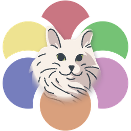
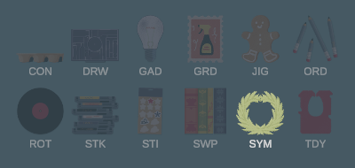
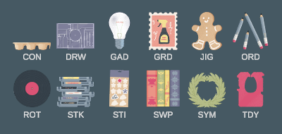
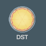

# A Little To The Left - Archipelago

An [Archipelago](https://archipelago.gg) multiworld randomizer for
[A Little To The Left](https://store.steampowered.com/app/1629520/), the
tidying puzzle game.

Your run is a track of puzzles, most of them procedurally generated. Their
solutions, the groups you tidy and the credits are checks; Puzzle Packs, the
game's mechanics (Stacking, Rotating, Drawer and the rest), Skips and Hint
Pages are items, and any player in the multiworld can be the one holding
yours. [What gets randomized](#what-gets-randomized) has the detail.

**Status: playable.** A seed generates, the game connects to it, and the run
plays through to the credits.

**Vibe coded with AI.** The mod, the apworld, the tools and these docs were
written with an AI coding assistant (Claude Code).

## Required software

- [A Little To The Left](https://store.steampowered.com/app/1629520/) on Steam
  (Windows). Both DLCs are supported and both are off by default.
- For the easy setup (recommended):
  [r2modman](https://thunderstore.io/package/ebkr/r2modman/) or
  [Thunderstore Mod Manager](https://www.overwolf.com/app/Thunderstore-Thunderstore_Mod_Manager).
- For the manual setup:
  [BepInEx 6 IL2CPP x64, build be.755](https://builds.bepinex.dev/projects/bepinex_be/755/BepInEx-Unity.IL2CPP-win-x64-6.0.0-be.755%2B3fab71a.zip)
  and `ALTTLArchipelago-X.Y.Z.zip` from the [releases page](../../releases).
- For whoever generates the multiworld:
  [Archipelago](https://github.com/ArchipelagoMW/Archipelago/releases/latest)
  0.6.7 or newer, and `alttl.apworld` from the [releases page](../../releases).

## Installation

### Easy setup (mod manager)

1. Install [r2modman](https://thunderstore.io/package/ebkr/r2modman/) (its
   **Manual Download** button, then the installer inside) or
   [Thunderstore Mod Manager](https://www.overwolf.com/app/Thunderstore-Thunderstore_Mod_Manager).
2. Open it, choose **A Little to the Left**, and select or create a profile.
3. Open the **Online** tab, search for **A Little to the Left Archipelago**,
   and press **Download**. BepInEx comes with it as a dependency.
4. Press **Start modded**. The first launch is slow while BepInEx generates its
   files. The main menu gains an **Archipelago** entry.

Or start from
[the mod's Thunderstore page](https://thunderstore.io/c/a-little-to-the-left/p/drohack/A_Little_to_the_Left_Archipelago/),
where **Install with Mod Manager** does steps 2 and 3 for you.

### Manual setup

1. **BepInEx 6 (IL2CPP)**: unzip
   [BepInEx-Unity.IL2CPP-win-x64-6.0.0-be.755](https://builds.bepinex.dev/projects/bepinex_be/755/BepInEx-Unity.IL2CPP-win-x64-6.0.0-be.755%2B3fab71a.zip), the build the mod
   is tested with (be.697 also works), into the game folder - the one containing
   `A Little To The Left.exe`.
2. **First launch**: start the game, wait for the main menu, quit. This launch
   is slow because BepInEx is generating interop assemblies.
3. **Mod**: unzip `ALTTLArchipelago-X.Y.Z.zip` from the
   [releases page](../../releases) into the same game folder.

### The apworld and the yaml

Every player needs `A Little to the Left.yaml`, and whoever generates the
multiworld needs `alttl.apworld`. Both are on the [releases page](../../releases):
take the release with the same version as your mod (a mod manager shows the
version it installed). The host puts `alttl.apworld` into Archipelago's
`custom_worlds/` folder and the yaml into `Players/`.

The three release files ship together and carry the same version number. A mod
and an apworld that disagree about the version disagree about the item table,
so the mod refuses such a pair when it connects rather than playing a subtly
wrong run.

Details, the yaml options and troubleshooting:
[docs/installation.md](docs/installation.md).

## Joining a MultiWorld game

Launch the game and use the **Archipelago** button on the main menu. Three
fields: **Server** (`host:port`, as the room page gives it), **Slot name**, and
**Password**. The run appears on the level select once you are connected. With
**Auto-connect** on, the game rejoins your multiworld every launch.

A randomized run keeps its own save: your campaign save is never written to.

A run also survives the server going away. If nothing answers at launch, the
mod resumes the last run from a cache of the slot data and the received items,
queues anything you earn, and sends it on the next connection.

## What gets randomized

The run is shaped like the base campaign - a scrolling filmstrip of cards -
but most of the puzzles in it are **procedurally generated**. Sixteen of the
game's puzzles build a fresh layout from a seed, so they are new even if you
have finished the game. They are mixed with the seasonal Archive puzzles and
with hand-made campaign puzzles where those are the only source of a mechanic.

**Locations.** Three kinds. Every distinct **solution** is a check, and puzzles
with several valid arrangements give several, each named for its ending
("Spoons - Solution: Stacked"), the same check whichever you find first. Every
**group** of objects you tidy is a check, on puzzles made of more than one
group - unless the group is itself an ending, which is then its one check,
and on a single-group puzzle the group and its solution are the same event,
so only one check is minted. And the **credits**.

Finishing a puzzle is not a check of its own. It is an event the generator
counts toward the goal, which is why a single-group puzzle pays one check
rather than two.

**Items.**

- **Puzzle Packs.** A run has no chapters. A pack opens the next block of
  cards instead - five puzzles at a time by default. Every block is the same
  size, the free opening included, and only the last is short.
- **The twelve mechanics**, one item each: Swapping, Stacking, Ordering,
  Gadgets, Rotating, Grids, Tidying, Containers, Drawer, Sticking, Symmetry
  and Jigsaw. Seeing Stars adds a thirteenth, Distributing, when it is on.
- **Credits.** A real item in the pool, so it can be anywhere in the
  multiworld, including in somebody else's world.
- **Skips.** Clears a puzzle you are stuck on - any puzzle: where the game's
  own skip does nothing (the generated puzzles, in a run), the mod clears it
  and takes you back to the level select. It finishes the puzzle and counts
  toward the goal, and it fills in every check on it - so a skipped puzzle is
  beaten and all its stars light.
- **Hint Pages.** Without one the notepad still opens; you just cannot erase
  the scribble.
- **Cat Trap.** The cat walks through an active puzzle and knocks your
  arrangement over. It costs time, never progress. On a puzzle with its own
  cat (Stamps, Shells, Place Setting, the Crackers), that cat reaches in
  first.
- **Background Change Trap.** Repaints the background.
- **Background Reset Token.** Spent from the pause menu's Reset Background
  entry: puts every backdrop back to the game's own colour until the next
  Background Change Trap. Never automatic.

**The goal.** Two conditions, and both are required: beat (or star) a set
number of puzzles, AND find the Credits item. Either one alone does nothing.
Together they unlock the credits card, which sits at the end of the track and
is not part of any pack - and you then have to go and play it. Reaching the
count does not end the run by itself, deliberately: the run ends when you
watch the ending.

Packs and abilities are the two gates, and they gate different things. A pack
decides which cards you may open at all. An ability decides what you may touch
once you are inside one: objects belonging to a mechanic you have not found
sit dimmed and cannot be moved, so a puzzle can be partly solved, left, and
come back to when the missing ability arrives.

### Ability locks

Twelve of the base game's own mechanics are items. The level select carries
all twelve as a strip, so what is still out there is visible rather than
something to keep a list of.

Dim is a mechanic you have not found yet; lit is one you hold:

<table width="100%">
<tr><th width="50%">Some found</th><th width="50%">Held</th></tr>
<tr>
<td></td>
<td></td>
</tr>
</table>

The icons are the game's own art rather than anything drawn for the mod - a
badge element, a puzzle piece or a level's object, one per mechanic, chosen to
be told apart at that size. Provenance for all twelve:
[docs/reference/ability-icons.md](docs/reference/ability-icons.md).

Seeing Stars adds a thirteenth. Distributing is the one DLC mechanic the base
game has no equivalent of - it governs a single puzzle, the pizza - so it
appears only in a run that drew that level, and the strip wraps to a third row
to hold it:

Solve a group the run cannot reach yet (a lock that did not hold, say) and its
check is kept rather than sent early: it goes out the moment the item arrives,
without revisiting the puzzle.

### What the mod puts on screen

- **A badge on every card**, saying whether the card is worth opening: green
  when everything left on it can be done now, green over red when only some of
  it can, red when none of it can yet (beaten or not - hover the card for its
  stars, or read the beaten count in the corner), and a star when there is
  nothing left.
- **The strip along the bottom** of the level select maps those badges, one
  square per card in the same colours; a pack not opened yet is plain
  outlines.
- **The ability strip** above, and **a progress counter** reading in the same
  terms as the goal - stars collected or puzzles beaten, whichever this seed
  asked for.
- **An Archipelago pane on the main menu** for the server (host and port
  together), slot name and password, so connecting never means editing a
  config file.
- **Toasts** for every item sent to or from you, worded and coloured the way
  Archipelago's own text client shows them.
- **Play and the next arrow** open the next puzzle the RUN wants, rather than
  the next one in the campaign's order. With nothing playable yet, they and a
  finished puzzle go straight to the level select, with a note that the run
  is waiting on items.
- **No Steam achievements.** While the mod is loaded the game's achievements
  and Steam stats are held back, run or no run: a run plays the game out of
  order and earns nothing they claim. `[Steam] AllowAchievements = true` in
  the mod's config turns them back on.

### Options

All set in the yaml. The ones that change a run most:

- `puzzle_count` - 10 to 130. The smallest run is two full packs of 5; the
  game's own campaign is 79, and past about 84 the level select's overview
  strip shrinks to fit.
- `goal` - `beat_levels` (beat `levels_to_beat` puzzles, 50 by default) or
  `collect_stars` (collect `stars_to_collect` stars, one per solution found,
  65 by default - what 50 of a default run's 70 puzzles are worth).
- `pack_size` - how many puzzles a pack opens, 5 to 20. Read it as a floor
  rather than a promise: packs grow together when yours would need more than
  the fourteen a run can carry.
- `generator_weight`, `archive_weight`, `base_weight`, `cupboards_weight`,
  `stars_weight` - relative weights for where each puzzle comes from:
  procedurally generated, seasonal event, main campaign, and each DLC. Ratios
  rather than percentages: they need not add up to 100, and 80/10/10 means the
  same as 8/1/1. A DLC's weight counts only while that DLC is on, so turning
  one on shrinks the other shares; the shipped yaml shows the resulting shares
  for the defaults.
- `mechanic_coverage` - slots reserved so scarce mechanics are guaranteed to
  turn up. Higher is LESS random, not more: every point pins more of the run
  to a fixed set of levels.
- `ability_locks`, `starting_abilities`, `guaranteed_open_slots` - whether
  mechanics are gated at all, and how much of that gate you start past. By
  default all five opening puzzles are solvable with what you start with.
- `skip_count`, `hint_coverage`, `cat_trap_chance`, `background_trap_chance`
  - how many Skips exist, what share of this seed's hint pages is sure to
  become items, and what share of the filler is each trap (15% each by
  default). The rest of the filler is split evenly between more Hint Pages and
  Background Reset Tokens.
- `archive_packs` - which seasonal packs are in. Without DLC, jigsaws exist
  only in four of them, so dropping those four removes the mechanic and its
  item with it.
- `generator_repeat_limit` - how often one generated puzzle may repeat, 1
  to 8 (8 by default; 0 in an older yaml means 8). Only generated puzzles
  repeat; every other puzzle appears at most once.
- `achievements` - off by default. On, the game's puzzle achievements (7 in
  the base game, 17 with both DLCs; Sweep Them On The Floor, Path of
  Destruction and Keep Away are left out) are checks when their puzzle is in the
  run. They are checks like any other: they can hold progression, a card's
  star waits for them, and a Skip sends them.
- `cupboards_and_drawers`, `seeing_stars` - the two DLCs, both off by default.

**Both DLCs are supported, and both are off by default.** Cupboards and Drawers
adds 25 puzzles and 32 solutions; Seeing Stars adds 37 puzzles and 100
solutions - more alternate solutions than the whole base campaign, which makes
it the one that changes a star goal most. Five of its puzzles are locked by the
game behind a star total, and the mod opens those. Each DLC has its own
credits, and with one on, the run may end on them instead of the base game's:
one is picked per seed, and the spoiler names it.

Only the player needs the DLC: the generator does not, and the mod refuses a
seed asking for one that is not installed rather than handing over a puzzle
that cannot open.

Full detail, including every option and what each item does:
[the world's game page](apworld/alttl/docs/en_A_Little_to_the_Left.md).

## Developing

How the repository is laid out, how to build without touching a player's
install, and how the tests and gates fit together:
[docs/dev/README.md](docs/dev/README.md). Every tool in `tools/` is indexed in
[tools/README.md](tools/README.md), and the DevTools research plugin's commands
in [docs/dev/devtools.md](docs/dev/devtools.md). What has been asked for and not
yet done is in [docs/dev/backlog.md](docs/dev/backlog.md).

## License

[MIT](LICENSE).

The BepInEx interop assemblies this repo builds against are generated from the
game, and are neither included here nor redistributable. You need your own copy
of the game to build the mod.
